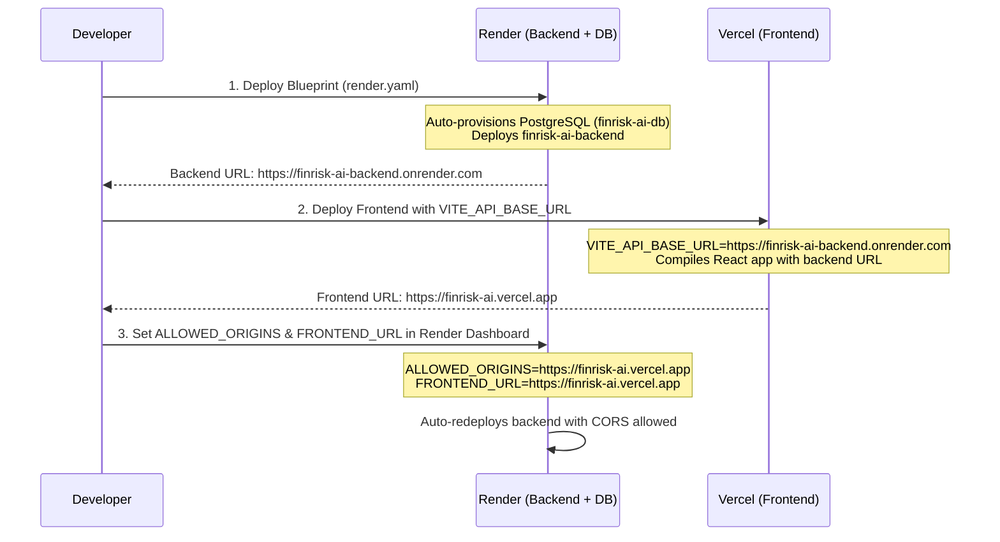

# TASK 24: FINRISK AI — DEPLOYMENT READINESS REPORT

## 1. Executive Summary

* **Deployment Readiness Status:** **READY WITH CONFIGURATION**
* **Blocker Count:** **0 Blockers**
* **Core Functionality:** All 20 feature tasks, security audits, blocker remediations, and CORS hardening are complete and verified.
* **Backend Test Suite:** **155 passed, 0 failed, 0 skipped** across all regression test suites.
* **Frontend Build & Lint:** Production build succeeded with **0 errors**; linter passed with **0 errors**.
* **Pre-Deployment Scope:** No cloud deployments occurred, no cloud resources were created, and no secrets were exposed.

The codebase is fully primed for dual-cloud deployment (Render for FastAPI backend + managed PostgreSQL; Vercel for React frontend). Deployment requires only entering the corresponding URLs in the respective hosting provider dashboards.

---

## 2. Files Inspected & Changed

### Inspected Files:
1. `render.yaml` — Render Blueprint definition for web service and managed PostgreSQL database.
2. `backend/requirements.txt` — Production Python dependencies.
3. `backend/config.py` — Centralized settings and CORS resolver.
4. `backend/main.py` — App entrypoint, middleware, database initialization, router registration, `/health` route.
5. `backend/database/session.py` — SQLAlchemy engine, session maker, and connection string parser.
6. `backend/database/migrations.py` — Idempotent schema migration runner.
7. `backend/routers/transaction.py`, `profile.py`, `report.py` — Module path resolution for `ml/predict.py`.
8. `ml/predict.py` — Model loader and path resolution.
9. `frontend/src/services/api.ts` — API client, request wrapper, and base URL resolution.
10. `frontend/vite.config.ts` — Vite build and dev server proxy configuration.
11. `frontend/vercel.json` & root `vercel.json` — Vercel SPA rewrites and build configurations.

### Changed Files in Task 24:
* **[`backend/database/session.py`](file:///Users/vaishakaryanpatel/.gemini/antigravity-ide/scratch/financial-risk-analyzer/backend/database/session.py)**:
  - Added `pool_pre_ping=True` to `create_engine()`. In cloud-hosted PostgreSQL environments (like Render), idle database connections are frequently terminated by cloud load balancers. `pool_pre_ping=True` transparently validates connections prior to use, preventing `psycopg2.OperationalError: server closed the connection unexpectedly`.
  - Added an active safety warning log that alerts if `is_production` is detected while `DATABASE_URL` is pointing to SQLite, guarding against accidental ephemeral data loss.

---

## 3. Render Backend Configuration Findings (Task 24A)

| Requirement | Verification | Finding |
|---|---|---|
| **1. Dependency Installation** | `buildCommand: pip install -r backend/requirements.txt` | **VERIFIED.** Installs all 20 required backend dependencies including `fastapi`, `uvicorn`, `sqlalchemy`, `psycopg2-binary`, `pandas`, `numpy`, `scikit-learn`, `joblib`, `boto3`, `pillow`, and `cryptography`. |
| **2. Application Launch** | `startCommand: cd backend && uvicorn main:app --host 0.0.0.0 --port $PORT` | **VERIFIED.** Launches Uvicorn referencing `main.py:app` after navigating into `backend/`. |
| **3. Working Directory & Module Paths** | `rootDir: .` + dynamic `sys.path` | **VERIFIED.** Working directory during execution is `backend/`. Direct imports (`from models...`, `from routers...`) resolve natively. Routers dynamically add parent directory to `sys.path` to import `ml.predict`. `ml/predict.py` loads `risk_model.json` using absolute file-relative paths. |
| **4. Port & Interface Binding** | `--host 0.0.0.0 --port $PORT` | **VERIFIED.** Binds to all network interfaces (`0.0.0.0`) and dynamically expands Render's assigned `$PORT` environment variable. |
| **5. PostgreSQL Database URL** | `fromDatabase: name: finrisk-ai-db, property: connectionString` | **VERIFIED.** Render automatically provisions and links the managed PostgreSQL database `finrisk-ai-db` to the backend web service. |
| **6. PostgreSQL Connection Protocol** | `session.py` protocol replacement | **VERIFIED.** Automatically transforms Render's `postgres://` connection strings to `postgresql://`, ensuring full compatibility with SQLAlchemy 2.0 and `psycopg2`. |
| **7. Database Initialization & Migrations** | `Base.metadata.create_all(bind=engine)` + `run_migrations()` | **VERIFIED.** Idempotent execution on startup. Compatible with both PostgreSQL and SQLite dialect data types (`VARCHAR`, `TIMESTAMP`, `BOOLEAN`, `FLOAT`, `TEXT`, `ON DELETE CASCADE`). |
| **8. SQLite Isolation in Production** | Render PostgreSQL mapping + logging guard | **VERIFIED.** In Render, `DATABASE_URL` is provisioned from PostgreSQL. A logging guard alerts immediately if SQLite is active in production. |
| **9. Explicit Environment Declaration** | `ENVIRONMENT: production` in `render.yaml` | **VERIFIED.** Explicitly configured in service `envVars`. |
| **10. CORS Wildcard Prevention** | `resolve_cors_origins()` in `config.py` | **VERIFIED.** If `ALLOWED_ORIGINS` is missing or empty in production, origins resolve to `[]` and `allow_credentials=False`. No wildcard fallback. |

---

## 4. Complete Production Environment Variable Checklist (Task 24B)

| Variable Name | Required / Optional | Target Feature | Configuration Source | Impact If Missing / Misconfigured |
|---|---|---|---|---|
| **`DATABASE_URL`** | **Required** | Core database / all models | Render Managed DB (`finrisk-ai-db`) | App falls back to local SQLite `/financial_risk.db` (data lost on container restart). |
| **`SECRET_KEY`** | **Required** | JWT auth & token signing | Render `generateValue: true` | Generated automatically by Render. If unset, uses fallback key (insecure). |
| **`ENVIRONMENT`** | **Required** | Core system & CORS policy | `render.yaml` (`value: production`) | Defaults to `development`, which allows localhost origins. |
| **`ALLOWED_ORIGINS`** | **Required** | CORS security middleware | Render Dashboard (Manual: Vercel URL) | **All cross-origin frontend requests blocked by CORS.** |
| **`FRONTEND_URL`** | **Required** | Password reset email links | Render Dashboard (Manual: Vercel URL) | Defaults to `http://localhost:5173`. Password reset links will point to localhost. |
| **`PORT`** | **Required** | Uvicorn HTTP server | Injected automatically by Render | App cannot bind to incoming HTTP traffic. |
| **`PYTHON_VERSION`** | **Recommended** | Python runtime environment | `render.yaml` (`value: "3.11"`) | Uses Render's default Python version. |
| **`PASSWORD_RESET_TOKEN_EXPIRE_MINUTES`** | Optional | Auth / password reset | Defaults to `30` | Falls back safely to 30 minutes. |
| **`GEMINI_API_KEY`** | Optional | AI chat advisor (`ai_service.py`) | Render Dashboard (Manual / Optional) | Falls back seamlessly to built-in deterministic rule-based FinTech advisor. |
| **`SMTP_HOST`** | Optional | Email service (`email_service.py`) | Render Dashboard (Manual / Optional) | Password reset emails logged to backend stdout rather than sent over SMTP. |
| **`SMTP_PORT`** | Optional | Email service | Defaults to `587` | Falls back to port 587. |
| **`SMTP_USERNAME`** | Optional | Email service | Render Dashboard (Manual / Optional) | Outbound SMTP disabled if empty. |
| **`SMTP_PASSWORD`** | Optional | Email service | Render Dashboard (Manual / Optional) | Outbound SMTP disabled if empty. |
| **`SMTP_FROM_EMAIL`** | Optional | Email service | Defaults to `noreply@finrisk.ai` | Falls back to default sender address. |
| **`SMTP_USE_TLS`** | Optional | Email service | Defaults to `true` | Uses TLS on port 587. |
| **`AVATAR_STORAGE_BACKEND`** | Optional | Profile avatar uploads | Defaults to `local` | Avatars saved to container disk (`/tmp` or `/uploads`), lost on free-tier restart. |
| **`S3_ENDPOINT_URL`** | Optional (if S3) | Cloudflare R2 / AWS S3 avatar storage | Render Dashboard (Manual / Optional) | S3 storage backend disabled if empty. |
| **`S3_BUCKET_NAME`** | Optional (if S3) | Avatar storage bucket | Render Dashboard (Manual / Optional) | S3 storage backend disabled if empty. |
| **`S3_ACCESS_KEY_ID`** | Optional (if S3) | Cloud storage credentials | Render Dashboard (Manual / Optional) | S3 storage backend disabled if empty. |
| **`S3_SECRET_ACCESS_KEY`** | Optional (if S3) | Cloud storage credentials | Render Dashboard (Manual / Optional) | S3 storage backend disabled if empty. |
| **`S3_REGION`** | Optional (if S3) | Cloud storage region | Defaults to `auto` | Falls back to auto region. |
| **`S3_PUBLIC_BASE_URL`** | Optional (if S3) | Public avatar CDN/bucket URL | Render Dashboard (Manual / Optional) | Generates direct bucket URLs. |
| **`BANK_SYNC_PROVIDER`** | Optional | Open Banking foundation | Defaults to `mock` | Mock bank sync provider enabled (safe for sandbox/demos). |
| **`BANK_SYNC_ENABLED`** | Optional | Bank connection features | Defaults to `true` | Enables bank sync module. |
| **`BANK_TOKEN_ENCRYPTION_KEY`** | Optional | Fernet token encryption | Render Dashboard (Manual / Optional) | Falls back to key derived from `SECRET_KEY`. |
| **`PLAID_CLIENT_ID`** | Optional | Live Plaid integration | Render Dashboard (Manual / Optional) | Live Plaid sync scaffold disabled. |
| **`PLAID_SECRET`** | Optional | Live Plaid integration | Render Dashboard (Manual / Optional) | Live Plaid sync scaffold disabled. |
| **`PLAID_ENV`** | Optional | Plaid environment | Defaults to `sandbox` | Uses sandbox mode. |

---

## 5. Vercel Frontend Configuration Checklist (Task 24C)

### A. Environment Variables Required on Vercel:
* **`VITE_API_BASE_URL`**
  - **Required:** Yes
  - **Value:** The Render backend URL (e.g., `https://finrisk-ai-backend.onrender.com`)
  - **Format:** Must NOT have a trailing slash (though frontend code includes `.replace(/\/+$/, "")` guard).
  - **Usage:** Injected at Vite build time into `frontend/src/services/api.ts`. All API requests (`/api/...`) and relative avatar requests (`/uploads/...`) are prefixed with this URL.

### B. Hardcoded Localhost Inspection:
* Search across `frontend/src/` for `localhost:8000` or `localhost:5173`:
  - **Result: 0 hardcoded occurrences.**
  - In local development (`VITE_API_BASE_URL` unset), Vite server proxy in `vite.config.ts` transparently routes `/api` and `/uploads` to `http://localhost:8000`.
  - In production (`VITE_API_BASE_URL` set), all fetch calls route directly to the configured Render backend.

### C. SPA Routing / Rewrites:
* `vercel.json` (root) and `frontend/vercel.json`:
  - Root `vercel.json`:
    ```json
    {
      "buildCommand": "cd frontend && npm install && npm run build",
      "outputDirectory": "frontend/dist",
      "rewrites": [
        {
          "source": "/(.*)",
          "destination": "/index.html"
        }
      ]
    }
    ```
  - **VERIFIED.** All deep links (e.g., `/dashboard`, `/transactions`, `/budget-planner`, `/forecast`, `/reset-password?token=...`) rewrite to `/index.html`, allowing React Router to handle client-side routing.

---

## 6. PostgreSQL & Database Initialization Findings

* **Schema Definition:** All 18 application tables are managed through declarative SQLAlchemy models inheriting from `Base`.
* **Table Creation:** `Base.metadata.create_all(bind=engine)` is called on application startup in `backend/main.py`.
* **Schema Evolution:** `database.migrations.run_migrations()` inspects existing tables and applies idempotent DDL changes (`ALTER TABLE ... ADD COLUMN`, `CREATE INDEX IF NOT EXISTS`, `CREATE UNIQUE INDEX IF NOT EXISTS`).
* **Dialect Compatibility:** All column data types (`VARCHAR`, `TIMESTAMP`, `BOOLEAN`, `FLOAT`, `TEXT`, `DATE`, `INTEGER`) and constraints are fully compliant with PostgreSQL standards.
* **Connection Pooling:** Added `pool_pre_ping=True` to `create_engine()` to handle cloud connection recycling seamlessly.

---

## 7. Validation Execution & Results (Task 24E)

### A. Full Backend Pytest Suite
* **Command:** `backend/venv/bin/pytest -v`
* **Result:** **155 passed, 0 failed, 0 skipped in 6.86s**
* **Suites Executed:**
  - `test_phase2_flow.py`: 58 passed (complete financial lifecycle, budget planner, goals, income allocations)
  - `test_cors.py`: 19 passed (CORS resolution matrix, preflight, origin validation, wildcard credentials prevention)
  - `test_password_reset.py`: 17 passed (token hashing, expiry, reuse protection, cooldown)
  - `test_recurring_payments.py`: 15 passed (detection, frequency categorization, user confirmation)
  - `test_bank_sync.py`: 14 passed (token encryption, idempotent transaction import, isolation)
  - `test_cash_flow_insights.py`: 12 passed (forecasting models, risk scoring, insight generation)
  - `test_avatar_storage.py`: 12 passed (upload validation, magic byte verification, local/S3 backend abstraction)
  - `test_auto_categorization.py`: 8 passed (keyword/merchant rules, confidence thresholds)

### B. Frontend Production Build
* **Command:** `cd frontend && npm run build`
* **Result:** **Exit Code 0, built in 545ms**
* **Output Artifacts:** `dist/index.html` (0.88 kB), `dist/assets/index-*.css` (49.76 kB), `dist/assets/index-*.js` (1,082.39 kB).

### C. Frontend Linter
* **Command:** `cd frontend && npm run lint`
* **Result:** **Exit Code 0, 0 errors** (5 non-blocking React fast-refresh / hook dependency warnings).

### D. YAML Configuration Syntax
* **Command:** Structural validation script in Node.js.
* **Result:** **Exit Code 0, 0 syntax errors, 0 tabs, 34 valid lines.**

---

## 8. Step-by-Step Manual Deployment Sequence

When you are ready to execute deployment:



### Exact Steps:

1. **Step 1 — Deploy Backend to Render:**
   - In Render Dashboard → **New** → **Blueprint**.
   - Connect the FinRisk AI repository. Render will parse `render.yaml`.
   - Render will create two resources:
     - `finrisk-ai-db` (Free PostgreSQL instance)
     - `finrisk-ai-backend` (Web Service)
   - When prompted for `ALLOWED_ORIGINS`, you can enter a temporary value or leave it to be updated in Step 3.
   - Once deployment completes, copy the backend URL (e.g., `https://finrisk-ai-backend.onrender.com`).

2. **Step 2 — Deploy Frontend to Vercel:**
   - In Vercel Dashboard → **Add New** → **Project**.
   - Import the FinRisk AI repository.
   - In **Environment Variables**, add:
     - `VITE_API_BASE_URL`: `https://finrisk-ai-backend.onrender.com` (use your actual Render URL from Step 1).
   - Click **Deploy**.
   - Once deployed, copy your production frontend URL (e.g., `https://finrisk-ai.vercel.app`).

3. **Step 3 — Link CORS in Render:**
   - Return to **Render Dashboard** → **`finrisk-ai-backend`** → **Environment**.
   - Set:
     - `ALLOWED_ORIGINS`: `https://finrisk-ai.vercel.app` (or comma-separated if using a custom domain: `https://finrisk-ai.vercel.app,https://yourdomain.com`)
     - `FRONTEND_URL`: `https://finrisk-ai.vercel.app`
   - Render will automatically trigger a zero-downtime redeploy.

4. **Step 4 — Verify Live Deployment:**
   - Visit `https://finrisk-ai.vercel.app`.
   - Register a new account.
   - Verify that login, dashboard metrics, transaction categorization, and budget features function properly.

---

## 9. Unresolved Blockers

* **None.** All P0 blockers, dependency conflicts, connection protocol mismatches, and CORS security issues have been remediated and verified.
